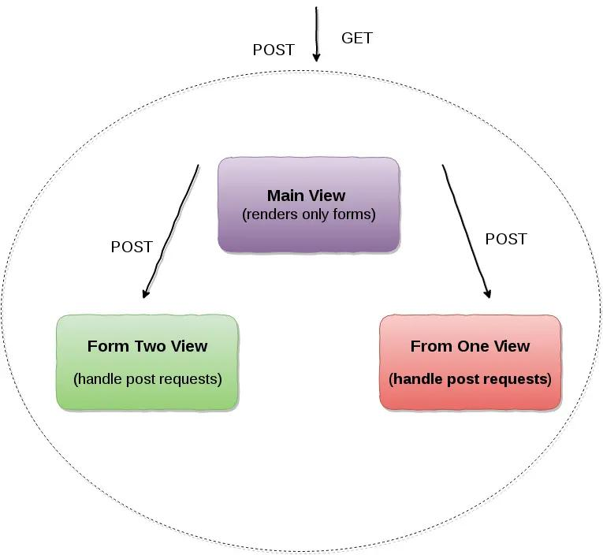

**This post is a reference for myself how to do a simple thing like rendering two forms in one view using django framework.**

How will it be working? The idea is very simple. There will be only one view to render both forms. Moreover, only GET method will be implemented to this view so there won't be a possibility to send POST request. Underneath the first main view will be 2 more views responsible only for handling POST request for both of forms. The simple picture presenting this can be seen below:



Let's jump into the code. At first, there is main view responsible for rendering forms:

```python
class MainView(TemplateView):
    template_name = 'sample_forms/index.html'

    def get(self, request, *args, **kwargs):
        question_form = QuestionForm(self.request.GET or None)
        answer_form = AnswerForm(self.request.GET or None)
        context = self.get_context_data(**kwargs)
        context['answer_form'] = answer_form
        context['question_form'] = question_form
        return self.render_to_response(context)
```

This is simple `TemplateView` which is responsible only for GET request. At first, my setup question and answer form from the request. Right after that I add these forms to context dictionary and render them on `sample_forms/index.html`.

My `sample_forms/index.html` looks as follows:

```html
<h1>Question Form</h1>
<form action="" method="post">
    {{ question_form }}
    <input type="submit" value="Send Question">
</form>
<h1>Answer Form</h1>
<form action="" method="post">
    {{ answer_form }}
<input type="submit" value="Send Answer">
</from>
```

I render both with different action so sending post request will point to different URL: question form to `question_form/submit` and answer form to `answer_form/submit`.

Take a look into view responsible for handling POST request for both forms:

```python
class QuestionFormView(FormView):
    form_class = QuestionForm
    template_name = 'sample_forms/index.html'
    success_url = '/'

    def post(self, request, *args, **kwargs):
        question_form = self.form_class(request.POST)
        answer_form = AnswerForm()
        if question_form.is_valid():
            question_form.save()
            return self.render_to_response(
                self.get_context_data(
                success=True
            )
        )
        else:
        return self.render_to_response(
        self.get_context_data(
                question_form=question_form,

        )


class AnswerFormView(FormView):
    form_class = AnswerForm
    template_name = 'sample_forms/index.html'
    success_url = '/'

    def post(self, request, *args, **kwargs):
        answer_form = self.form_class(request.POST)
        question_form = QuestionForm()
        if answer_form.is_valid():
            answer_form.save()
            return self.render_to_response(
                self.get_context_data(
                success=True
            )
        )
        else:
            return self.render_to_response(
            self.get_context_data(
                    answer_form=answer_form,
                    question_form=question_form
            )
        )
```

They are almost the same so I describe only one of them: `QuestionFormView`. In `post`, I instantiate `question_form` with POST request with user input. Right after that, I initialize empty `answer_form` because when the first form will have some errors I want to present them and the second form. Without that only form with errors will be rendered. Next lines are simple: check if forms have errors: if not save the form and render `index.html` with additional data `success`. Why? Because I can render on the same page information for the user that request was sent like:

```html

<h1>Your request has been submitted</h1>
 # Forms here 
```

If the user input was invalid I render both forms: one with errors and other without.

That's all for this post! Feel free to comment it! Code for this you can find under this [link](https://github.com/krzysztofzuraw/personal-blog-projects).
