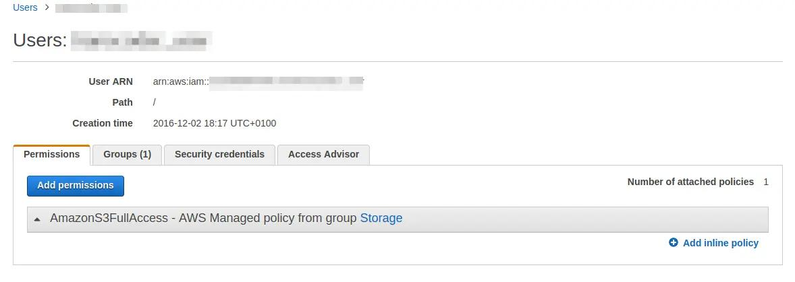
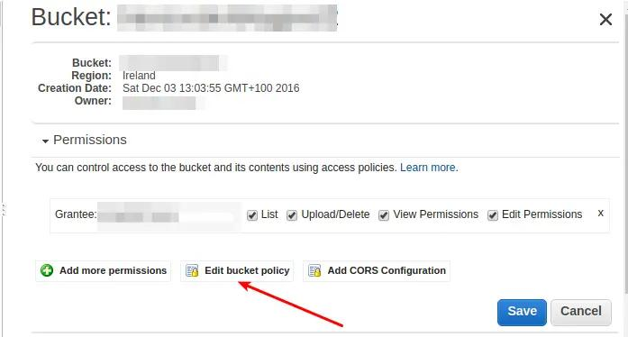
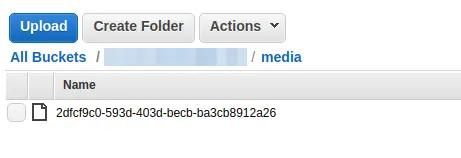
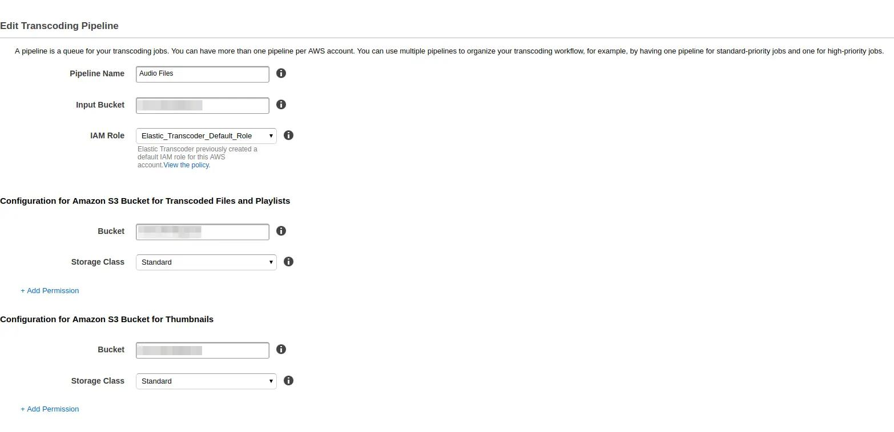
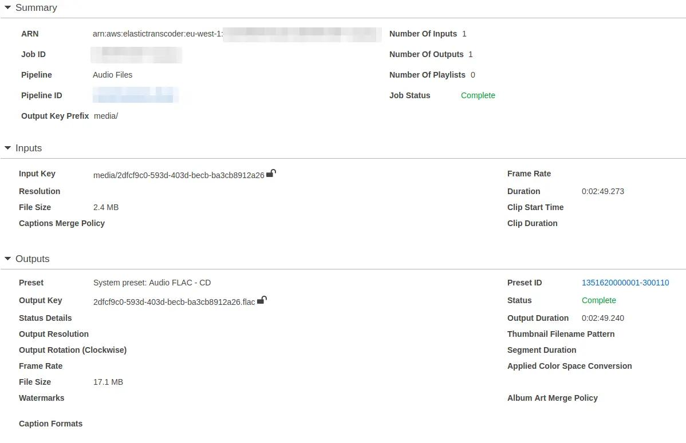
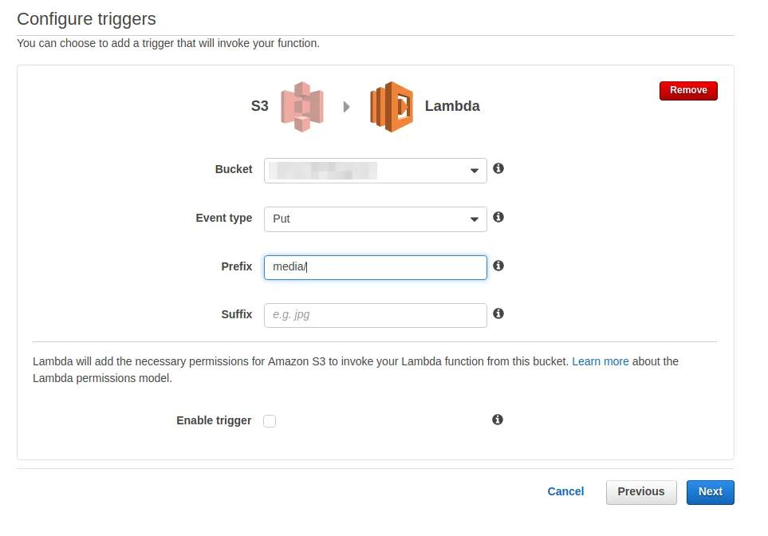
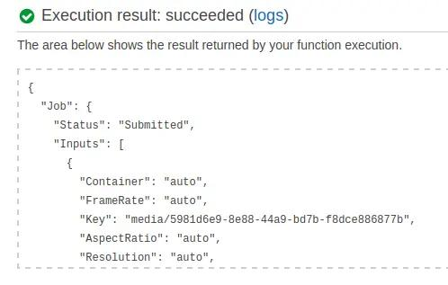
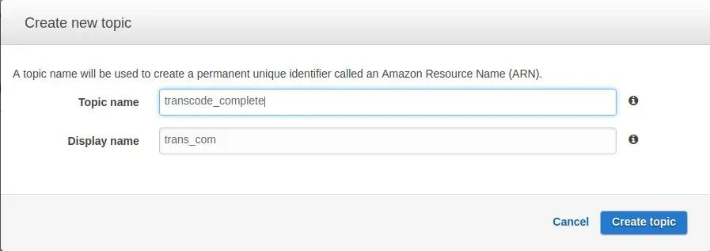
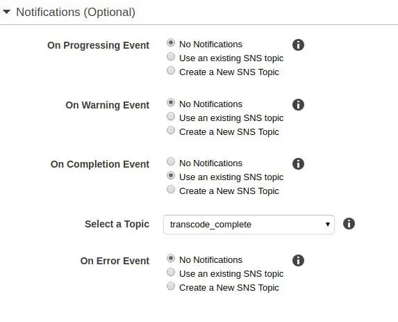
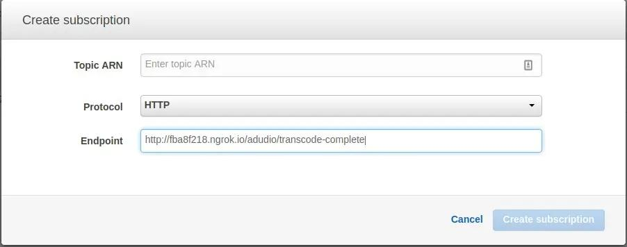

**Nowadays moving everything to the cloud becomes more and more popular.
A lot of software companies move their technology stack to such
infrastructure. One of the biggest players in this field is Amazon Web
Services - AWS. That's why I decided decided to adapt existing code from
my previous project and move transcoding to write blog posts about that.
In this series I process to cloud.**

## Overview of series

I decided to adapt code from my previous blog series about celery and
rabbit-mq. I did that because code
from this django application actually transcodes mp3 files to other
formats. This series will be divided into these parts:

- Moving static and media files to AWS
- Transcoding files inside AWS transcoder
- Notifying user that transcode is complete
- User downloads transcoded file

## Moving static and media files to AWS

AWS transcoder operates only on files that are inside S3 bucket so first
I need to change how these files are served in django.

Let's say that I already had my account on AWS. Next step is to generate
specific account using
[IAM](http://docs.aws.amazon.com/IAM/latest/UserGuide/introduction.html).
While creating a user I want to give him access to AWS S3:



and after I download its credentials I can create S3 container - I have
chosen Ireland because with Frankfurt I have a problem with uploading
files to S3. After bucket creation, it's time to add policy. The policy
is JSON that tells AWS which user can access given bucket.
More information about that can be found
[here](http://docs.aws.amazon.com/AmazonS3/latest/dev/intro-managing-access-s3-resources.html).
Adding policy is quite simple from S3 management view:



This policy looks like this:

```json
{
  "Version": "2008-10-17",
  "Statement": [
    {
      "Sid": "PublicReadForGetBucketObjects",
      "Effect": "Allow",
      "Principal": {
        "AWS": "*"
      },
      "Action": "s3:GetObject",
      "Resource": "AWS_RESOURCE"
    },
    {
      "Effect": "Allow",
      "Principal": {
        "AWS": "AWS_PRINCIPAL"
      },
      "Action": "s3:*",
      "Resource": ["AWS_RESOURCE"]
    }
  ]
}
```

Where `AWS_PRINCIPAL` is your IAM user in format of [ARN
resource](http://docs.aws.amazon.com/general/latest/gr/aws-arns-and-namespaces.html):
`"arn:aws:iam::AMAZON_ID:user/IAM_USER"` and `AWS_RESOURCE`:
`arn:aws:s3:::S3_BUCKET_NAME/*`.

As I have this set up right now I can make changes in the application
itself. To use S3 as a static and media files container I used
[django-storages](https://django-storages.readthedocs.io/en/latest/). To
make django-storages to work I have to add couple things in settings.py:

```python
import environ
env = environ.Env()


INSTALLED_APPS = [
  # other applicaitons
  'storages',
]

AWS_STORAGE_BUCKET_NAME = env('AWS_STORAGE_BUCKET_NAME')
AWS_ACCESS_KEY_ID = env('AWS_ACCESS_KEY_ID')
AWS_SECRET_ACCESS_KEY = env('AWS_SECRET_ACCESS_KEY')
AWS_S3_CUSTOM_DOMAIN = '%s.s3.amazonaws.com' % AWS_STORAGE_BUCKET_NAME
AWS_HEADERS = {
    'Expires': 'Thu, 15 Apr 2010 20:00:00 GMT',
    'Cache-Control': 'max-age=86400',
}
AWS_S3_HOST = 's3-eu-west-1.amazonaws.com'
```

I'm using here another package called
[django-environ](https://github.com/joke2k/django-environ). It allows me
to get certain settings from environmental variables. I'm setting them
in my virtualenvwrapper script inside `$ENV_PATH/bin/postactivate`:

```shell
export AWS_STORAGE_BUCKET_NAME='name'
export AWS_ACCESS_KEY_ID='key'
export AWS_SECRET_ACCESS_KEY='acces_id'
```

The last line with `AWS_S3_HOST` is really important here as boto -
client that django-storages use underneath to connect to AWS doesn't
have default region set up. If this is not specified I upload files with
redirection which don't allow to transfer static files or upload any
large media file.

As I have AWS settings set up there is time to change static files
settings in settings.py:

```python
STATICFILES_LOCATION = 'static'
STATIC_URL = "https://%s/%s/" % (AWS_S3_CUSTOM_DOMAIN, STATICFILES_LOCATION)
STATICFILES_STORAGE = 'audio_transcoder.storages.StaticStorage'
STATICFILES_DIRS = (
  os.path.join(BASE_DIR.root, 'static'),
)
```

I add custom `StaticStorage` as I want my static files to be under
static in S3 bucket:

```python
from django.conf import settings
from storages.backends.s3boto import S3BotoStorage


class StaticStorage(S3BotoStorage):
  location = settings.STATICFILES_LOCATION
```

To upload my static files I run `python manage.py collectstatic`.
After a while I can see that my files are in a bucket:


Right now when I run my server I can see the location of my static
files:


As static files are working it's high time to use AWS for media files.
Right now it's simple - in settings I add:

```python
MEDIAFILES_LOCATION = 'media'
MEDIA_URL = "https://%s/%s/" % (AWS_S3_CUSTOM_DOMAIN, MEDIAFILES_LOCATION)
DEFAULT_FILE_STORAGE = 'audio_transcoder.storages.MediaStorage'
```

with custom storage:

```python
class MediaStorage(S3BotoStorage):
  location = settings.MEDIAFILES_LOCATION
```

Now when I upload my mp3 file it's sent directly to S3 bucket under
media location:



**As I have static and media files integrated with AWS now it's time to
transcode them. In this post, I will write a short example of how to
integrate AWS ElasticTranscoder with Django application.**

## Basic terms

ElasticTranscoder allows you to transcode files from your S3 bucket to
various formats. To set this service up first you have to create a
pipeline. What pipeline is? It's a workflow- how your
transcoder should work. You can create a different pipeline for long
content and different for short one. In my application I created the
following pipeline:



As I have my pipeline configured next step is to create jobs. Jobs are
tasks for a transcoder that say which file I want to transcode, to what
format or codec I want to do this:



PresetID is user created or already existing configuration that defines
the format of transcoder output: is it mp4 or maybe flac? What
resolution should video files have? All of this is set up in present.

As we know basic terms used in AWS Elastic Transcoder let's jump into
the code.

## Code

AWS has very good python API called
[boto3](http://boto3.readthedocs.io/en/latest/). Using that API and few
examples from the internet I was able to create a simple class to create
transcode job:

```python
import os

from django.conf import settings

import boto3


class AudioTranscoder(object):

  def __init__(self, region_name='eu-west-1', pipeline_name='Audio Files'):
      self.region_name = region_name
      self.pipeline_name = pipeline_name
      self.transcoder = boto3.client('elastictranscoder', self.region_name)
      self.pipeline_id = self.get_pipeline()

  def get_pipeline(self):
      paginator = self.transcoder.get_paginator('list_pipelines')
      for page in paginator.paginate():
          for pipeline in page['Pipelines']:
              if pipeline['Name'] == self.pipeline_name:
                  return pipeline['Id']

  def start_transcode(self, filename):
      base_filename, _ = self.create_aws_filename(filename, '')
      wav_aws_filename, wav_filename = self.create_aws_filename(
          filename, extension='.wav'
      )
      flac_aws_filename, flac_filename = self.create_aws_filename(
          filename, extension='.flac'
      )
      mp4_aws_filename, mp4_filename = self.create_aws_filename(
          filename, extension='.mp4'
      )
      self.transcoder.create_job(
          PipelineId=self.pipeline_id,
          Input={
              'Key': base_filename,
              'FrameRate': 'auto',
              'Resolution': 'auto',
              'AspectRatio': 'auto',
              'Interlaced': 'auto',
              'Container': 'auto'
          },
          Outputs=[{
              'Key': wav_aws_filename,
              'PresetId': '1351620000001-300300'
              }, {
              'Key': flac_aws_filename,
              'PresetId': '1351620000001-300110'
              }, {
              'Key': mp4_aws_filename,
              'PresetId': '1351620000001-100110'
              }
          ]
      )
      return (wav_filename, flac_filename, mp4_filename)

  @staticmethod
  def create_aws_filename(filename, extension):
      aws_filename = os.path.join(
          settings.MEDIAFILES_LOCATION, filename + extension
      )
      return aws_filename, os.path.basename(aws_filename)


transcoder = AudioTranscoder()
```

Going from the top - I specified my `region_name` as well as
`pipeline_name` for boto3 to know to which region it should connect. In
method `get_pipeline` I iterate through all available pipelines and
return that has the same name as `pipeline_name`. In this function
`paginator` is an object which holds on portion of data so user don't
have to wait until all available pipelines are fetched.

The main logic is in `start_transcode` method. At the beginning, I used
helper function `create_aws_filename` that's creating proper AWS file
name like `media/my_mp3.mp3` and returns that whole path with filename.
After I created filenames for all of my files I'm calling `create_job`
that creates a job basing on `pipeline_id` and `base_filename`. The job
can have multiple outputs so I specified one for wav, flac and mp4
files. How is it used in code? Let's go to view:

```python
class UploadAudioFileView(FormView):
  # some code

  def form_valid(self, form):
      audio_file = AudioFile(
            name=self.get_form_kwargs().get('data')['name'],
            mp3_file=self.get_form_kwargs().get('files')['mp3_file']
      )
      audio_file.save()
      wav_filename, flac_filename, mp4_filename = transcoder.start_transcode(
          filename=audio_file.mp3_file.name
      )
      audio_file.mp4_file = mp4_filename
      audio_file.flac_file = flac_filename
      audio_file.wav_file = wav_filename
      audio_file.save()
      return HttpResponseRedirect(
          reverse('audio:detail', kwargs={'pk': audio_file.pk})
      )
```

In `form_valid` first I'm calling `save()` on `AudioFile` object which
is uploading the file to S3 bucket. Then I'm using
`transcoder.start_transcode` and basing on output from this function I
match filenames to their respective fields. I know that this solution is
not the best one as I have to call `save` twice and if you have a better
way to do this I'm glad to hear it from you.

**I've ran transcoder from django application using AWS python API. But
there is also one more way to do the same - use AWS Lambda. Today I will
write how to use this tool to trigger transcoding of uploaded files.**

## What is AWS Lambda

[AWS Lambda](http://docs.aws.amazon.com/lambda/latest/dg/welcome.html)
is a service that allows you to run code against some event. What event
may you say? For instance uploading a file to S3 bucket. In my example,
I use this service to start transcode jobs. User upload file to
`media/music_file` and then instead of firing up event from django
application I trigger AWS Lambda function that does the same job.

Right now it's time to jump into the code.

## Setting up AWS Lambda for transcoder

When you want to create an AWS Lambda functions you can use a couple of
predefined functions a.k.a blueprints. As a base, I used one called:
`s3-get-object-python`. As you chosen your function now it's time to add
trigger so the function can run.



And AWS Lambda function is created! But by default, it only gets content
type of the object that is put in the S3 bucket. If I want to start to
transcode job I can use following code:

```python
import os
import boto3


def lambda_handler(event, context):
  transcoder = boto3.client('elastictranscoder', 'eu-west-1')
  pipeline_id = get_pipeline(transcoder, 'Audio Files')
  base_filename = os.path.basename(event['Records'][0]['s3']['object']['key'])
  output = transcoder.create_job(
      PipelineId=pipeline_id,
      Input={
          'Key': create_aws_filename('media', base_filename, ''),
          'FrameRate': 'auto',
          'Resolution': 'auto',
          'AspectRatio': 'auto',
          'Interlaced': 'auto',
          'Container' : 'auto'
      },
      Outputs=[{
          'Key': create_aws_filename('transcoded', base_filename, '.wav'),
          'PresetId': '1351620000001-300300'
          }, {
          'Key': create_aws_filename('transcoded', base_filename, '.flac'),
          'PresetId': '1351620000001-300110'
          }, {
          'Key': create_aws_filename('transcoded', base_filename, '.mp4'),
          'PresetId': '1351620000001-100110'
          }
      ]
  )
  return output


def get_pipeline(transcoder, pipeline_name):
      paginator = transcoder.get_paginator('list_pipelines')
      for page in paginator.paginate():
          for pipeline in page['Pipelines']:
              if pipeline['Name'] == pipeline_name:
                  return pipeline['Id']


def create_aws_filename(folder, filename, extension):
      aws_filename = os.path.join(
          folder, filename + extension
      )
      return aws_filename
```

It's code from my previous posts but modified in a few places so it can
work in AWS Lambda. In this service, you can use python 2.7. The main
function is called `lambda_handler` and takes an event from S3 in form
of JSON and context which is python object. As you can see creating
`transcoder` and `pipeline_id` are the same as previously.
`base_filename` is taken from event JSON. Then I create transcode job
and return its output.

As you may noticed I specified a different folder for outputs than for
inputs. Why? Because this function has trigger for put in `media`. Then
it starts transcoder jobs that are creating files on S3 bucket. If I
specified the same location for output I can start recursion and AWS
Lambda start triggering itself. It's not a good idea and doesn't try
this at home unless you have a lot of money. That's why it is so
important to test your code before you run it. It's possible - while
saving your code you can add the event to test so your AWS Lambda the
function will run against this test event:

```json
{
  "Records": [
    {
      "eventVersion": "2.0",
      "eventTime": "2016-12-15T21:20:44.231Z",
      "requestParameters": {
        "sourceIPAddress": "IP_ADDRESS"
      },
      "s3": {
        "configurationId": "configurationId",
        "object": {
          "eTag": "eTag",
          "sequencer": "sequencer",
          "key": "media/5981d6e9-8e88-44a9-bd7b-f8dce886877b",
          "size": 571258
        },
        "bucket": {
          "arn": "arn:aws:s3:::YOUR_BUCKET_NAME",
          "name": "YOUR_BUCKET_NAME",
          "ownerIdentity": {
            "principalId": "YOUR_BUCKET_ID"
          }
        },
        "s3SchemaVersion": "1.0"
      },
      "responseElements": {
        "x-amz-id-2": "x-amz-id-2",
        "x-amz-request-id": "x-amz-request-id"
      },
      "awsRegion": "eu-west-1",
      "eventName": "ObjectCreated:Put",
      "userIdentity": {
        "principalId": "AWS:USER_ID"
      },
      "eventSource": "aws:s3"
    }
  ]
}
```

Right now clicking test you can know if your function is behaving
correctly:



That's all! Your function is working and creating transcode jobs. This
is another way of accomplishing the same result -transcoding the files
uploaded from Django.

**As I have my transcoder up and running now it's time to let user know
that their uploaded files were transcoded. To this occasion I will use
AWS SNS service which allows me to send notification about completion of
transcode job.**

## Setting up AWS SNS to work with AWS Transcoder

After logging to AWS console and selecting SNS I have to create a topic:



Topic is endpoint for other application in AWS to send their
notifications. For my case I have to change it in AWS Transcoder
pipeline settings:



Last thing I have to do was to create subscription for topic created
above. They are a lot of types of subscription that you can find in SNS
settings but I will be using HTTP request.

## Receiving notifications from SNS service in Django

The flow of application will look like this:

1.  User upload a file
2.  File is sent to S3
3.  Transcode job is fired after uploading form view
4.  After transcode completion AWS transcoder sends SNS notification
5.  This notification is taken by SNS subscription and send to my
    endpoint
6.  After validating notification endpoint inform user that his or her
    files are transcoded

To receive HTTP notifications I have to create a endpoint in my Django
application. First I add url in `audio_transcoder/urls.py`:

```python
url(
      regex=r'^transcode-complete/$',
      view=views.transcode_complete,
      name='transcode-complete'
  )
```

Code for this endpoint looks as follows (`audio_transcoder/views.py`):

```python
from django.views.decorators.csrf import csrf_exempt
from .utlis import convert_sns_str_to_json
from django.http import (
  HttpResponse,
  HttpResponseNotAllowed,
  HttpResponseForbidden
)

@csrf_exempt
def transcode_complete(request):
    if request.method != 'POST':
        return HttpResponseNotAllowed(request.method)
    if request.META['HTTP_X_AMZ_SNS_TOPIC_ARN'] != settings.SNS_TOPIC_ARN:
        return HttpResponseForbidden('Not vaild SNS topic ARN')
    json_body = json.loads(request.body.decode('utf-8'), object_hook=convert_sns_str_to_json)
    if json_body['Message']['state'] == 'COMPLETED':
        # do something
        pass
    return HttpResponse('OK')
```

What is happening there? The first 2 ifs in `transcode_complete` are for
checking if user sends POST request and as a [SNS
documentation](http://docs.aws.amazon.com/sns/latest/dg/SendMessageToHttp.html)
says I have to make sure that message received are valid as everyone can
send request to this endpoint.

In line with `json_body` I have to use helper that I pass to
`object_hook`:

```python
import json


def convert_sns_str_to_json(obj):
  value = obj.get('Message')
  if value and isinstance(value, str):
      obj['Message'] = json.loads(value)
  return obj
```

This small function is for converting nested strings received from SNS
to python dicts. I know that every notification will have `Message` key
so based on that I can load string and convert it to python dictionary.

The last `if` will be completed in next blog post.

Right now I have my endpoint up and running. But there is a problem -
Amazon SNS needs to have access to that endpoint and I'm developing this
application on my localhost. How to overcome such issue? I used
[ngrok](https://ngrok.com/) which allows me to tunnel to my localhost
from internet. How to use it? After downloading and unpacking you first
run:

```shell
$ python transcoder/manage.py runserver 0.0.0.0:9000
```

And in other window:

```shell
$ ./ngrok http 9000
```

Ngrok will start and you can use url shown in console - for me:
http://fba8f218.ngrok.io/.

With this url I go to AWS SNS subscription tab and add new subscription:



After setting this up you will receive SNS message with link that you
need to paste in browser to confirm subscription.

## How message application should work

From previous I know
that the last point of my application flow is to inform user that file
is transcoded and ready to download. To do such thing I have to display
message on every webpage that current user is. This message should have
information about which file was processed. First I wanted to do this
with existing django messaging framework but as it turns out is works
only with request. As I decided to show message for different users as
long as they dismiss this information I had to write my own small
application.

## Implementation in django

In my newly created application I created following model:

```python
from django.db import models
from django.contrib.auth.models import User


class Message(models.Model):
    text = models.CharField(max_length=250)
    read = models.BooleanField(default=False)

    def __str__(self):
        return self.text
```

I decided to display my message only when it wasn't read. Based on that
right now I can use it in endpoint that works with AWS
(`audio_transcode/views.py`):

```python
@csrf_exempt
def transcode_complete(request):
    # rest of code is in previous blog post
    if json_body['Message']['state'] == 'COMPLETED':
        audio_file = AudioFile.objects.get(
            mp3_file=json_body['Message']['input']['key'][6:]
        )
        Message.objects.create(
        text='Your file {} has been processed'.format(audio_file.name)
         )
    return HttpResponse('OK')
```

As my message is created right now comes time for displaying it to the
user. To do that I have to add a message to template context. It can be
done via creating your own context manager:

```python
from .models import Message

def message_context_processor(request):
    if request.user.is_anonymous():
        return {'messages': []}
    return {'messages': Message.objects.filter(read=False)}
```

And registering it:

```python
TEMPLATES = [
    {
        # rest of options
        'OPTIONS': {
            'context_processors': [
            # rest of context processors
        'transcode_messages.context_processors.message_context_processor'
        ],
        },
 },
 ]
```

And adding a message as django template tag:

```html
 
<div
  class="alert alert-success alert-dismissible"
  data-message-id="{{ message.id }}"
  data-message-url=""
  role="alert"
>
  <button type="button" class="close" data-dismiss="alert" aria-label="Close">
    <span aria-hidden="true">x</span>
  </button>
  {{ message.text }}
</div>
 
```

Which renders as follows:


In the previous screenshot, there is an X that dismiss the message and
make it read. To communicate with the backend I wrote quick jQuery
script:

```javascript
var csrftoken = Cookies.get("csrftoken");

function csrfSafeMethod(method) {
  // these HTTP methods do not require CSRF protection
  return /^(GET|HEAD|OPTIONS|TRACE)$/.test(method);
}
$.ajaxSetup({
  beforeSend: function (xhr, settings) {
    if (!csrfSafeMethod(settings.type) && !this.crossDomain) {
      xhr.setRequestHeader("X-CSRFToken", csrftoken);
    }
  },
});

$(".alert").on("closed.bs.alert", function (event) {
  $.ajax({
    url: event.target.dataset.messageUrl,
    method: "POST",
    data: { message_id: event.target.dataset.messageId },
  });
});
```

Going from the top - django by default uses csrftoken so I have to get
it that my request passes the authentication. I'm using here library
called [js-cookie](https://github.com/js-cookie/js-cookie). In
`ajaxSetup` I tell jQuery to always send csrftokens while using ajax
request. Below I add the event listener to an element that has `.alert`
class. This event - `closed.bs.alert` is provided by bootstrap. On
triggering this event I send ajax POST to url from data attribute in
alert element -`data-message-url`. Data that I send is taken from
`data-message-id` attribute on alerts div. How endpoint for receiving
such messages looks like? See below:

```python
from .models import Message
from django.http import HttpResponse


def read_message(request):
     message = Message.objects.get(id=request.POST['message_id'])
 message.read = True
 message.save()
 return HttpResponse('OK')
```

Here I take `message_id` and set read to True and save message.

That's all for this blog post and blog series! I know that in this
design are particular flaws like: what is there will be more users than
one? Everybody will see everyone messages. If you have idea how to fix
that please write in comments below.

The code that I have made so far is available on
[github](https://github.com/krzysztofzuraw/blog_transcoder_aws). Stay
tuned for next blog post from this series.
