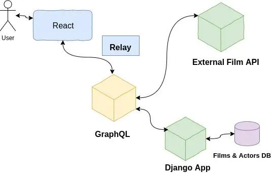

**Hello! Welcome back after a little break - I recently started working
on a project that uses GraphQL. Thant's why I thought that it will be
the best to show you how to build a simple application using these
tools. Let's get started!**

First, comes this idea - what application can I create so I will be able
to use Django, [GraphQL](http://graphql.org/learn/), React &
[Relay](https://facebook.github.io/relay/)?

After few minutes/hours, I decided to create simple film database. In my
Django application, I will be keeping records of actors & films. GraphQL
will fetch them but also will get data from external source. React will
consume GraphQL response using Relay.

For better understanding I created this diagram:



As you can see light blue color represents frontend part of a whole
application. Yellow is GraphQL layer - I like to think about it in terms
of a gate to API. API word is combined with Django Application that uses
PostgreSQL database and external film API. They are in green color.

I will use a library called
[`graphene-django`](https://github.com/graphql-python/graphene-django). It
will help a lot and allow me to get the job done instead of writing
boilerplate code.

I decided I will have 3 django applications: actors, films and movies
database. The first two should be self-explanatory, the last one is
simple integration with third-party api - [The Movie Data
Base](https://www.themoviedb.org/).

Let's start from actors application - it will have actor model:

```python
class Actor(models.Model):
    RATING_CHOICES = (
        (1, 1),
        (2, 2),
        (3, 3),
        (4, 4),
        (5, 5)
    )
    first_name = models.CharField(max_length=100)
    last_name = models.CharField(max_length=100)
    age = models.PositiveSmallIntegerField()
    rating = models.PositiveSmallIntegerField(choices=RATING_CHOICES)

    def __str__(self):
        return f'Actor: {self.first_name} {self.last_name}'
```

Here is the most important part of the design - schema:

```python
import graphene
from graphene_django.types import DjangoObjectType

from .models import Actor


class ActorType(DjangoObjectType):
    class Meta:
        model = Actor


class Query(graphene.AbstractType):
    all_actors = graphene.List(ActorType)
    actor = graphene.Field(
        ActorType,
        id=graphene.Int(),
    )

    def resolve_all_actors(self, args, context, info):
        return Actor.objects.all()

    def resolve_actor(self, args, context, info):
        id = args.get('id')
        return Actor.objects.get(id=id)
```

It is for GraphQL to know how data in django look like. I have Query
which is a way of saying to GraphQL that we want to ask for either all
actors or for specific one. I also add a handy shortcut from
`graphene_django` called `DjangoObjectType` - all I need is to provide a
model and it will know which field particular model has.

I got also `resolve_actor` & `resolve_all_actors` so I can either query
for all of them in GraphQL. I can go to `http://127.0.0.1:8000/graphql`
and execute:

```javascript
query{
    allActors{
        lastName
    }
}
```

to get response:

```javascript
{
    "data": {
        "allActors": [
        {
            "lastName": "Travolta"
        },
        {
            "lastName": "Jackson"
        },
        {
            "lastName": "Thurman"
        },
        {
            "lastName": "Foxx"
        },
        {
            "lastName": "Waltz"
        },
        {
            "lastName": "DiCaprio"
        },
        {
            "lastName": "Pitt"
        },
        {
            "lastName": "Laurent"
        },
        {
            "lastName": "Russell"
        },
        {
            "lastName": "Leigh"
        }
        ]
    }
}
```

or for one actor:

```javascript
{
    actor(id: 1) {
        firstName
        lastName
    }
}
```

and get:

```javascript
{
    "data": {
        "actor": {
        "firstName": "John",
        "lastName": "Travolta"
        }
    }
}
```

Exact the same thing I did for films application - schema looks like
this:

```python
class FilmType(DjangoObjectType):
    actors = graphene.List(ActorType)

    class Meta:
        model = Film

    @graphene.resolve_only_args
    def resolve_actors(self):
        return self.actors.all()


class Query(graphene.AbstractType):
    all_films = graphene.List(FilmType)
    film = graphene.Field(
        FilmType,
        id=graphene.Int(),
    )

    def resolve_all_films(self, args, context, info):
        return Film.objects.all()

    def resolve_film(self, args, context, info):
        id = args.get('id')
        return Film.objects.get(id=id)
```

Everything here is almost the same but I got many to many relation in a
database between `Film` & `Actor` model. In order for GraphQL to
understand it I need to use decorator `resolve_only_args`. As the name
suggests function wrapped inside decorator will be resolved using
arguments passed - in this case, I will be Film instance so I can get
all actors that played in this movie:

```javascript
{
    film(id: 1) {
        title
        actors {
            firstName
            lastName
        }
    }
}
```

```javascript
{
    "data": {
        "film": {
            "title": "Pulp Fiction",
            "actors": [
                {
                "firstName": "John",
                "lastName": "Travolta"
                },
                {
                "firstName": "Samuel L.",
                "lastName": "Jackson"
                },
                {
                "firstName": "Uma",
                "lastName": "Thurman"
                }
            ]
        }
    }
}
```

The last bit missing is external api which I implemented in a way to
cache as much as I can:

```python
URL = "https://api.themoviedb.org/3/search/movie"


class ExternalMovie(object):

    session = requests.Session()

    def __init__(self, title):
        self._payload = {'api_key': settings.TMDB_API_KEY, 'query': title}

    @cached_property
    def description(self):
        response = self.session.get(URL, data=self._payload)
        response.raise_for_status()
        return response.json()['results'][0]['overview']
```

I use `cached_property` so next calls via GraphQL will be cached. Schema
to this is very simple:

```python
class Query(graphene.AbstractType):
    description = graphene.String(title=graphene.String())

    def resolve_description(self, args, context, info):
        title = args.get('title')
        external_movie = ExternalMovie(title=title)
        return external_movie.description
```

and allows me to query for description:

```javascript
{
  description((title: "Pulp Fiction"));
}
```

```javascript
{
    "data": {
        "description": "..."
    }
}
```

That's all for today! Feel free to comment - was this blog post helpful?
Was something missing?

Repo with code can be found on
[github](https://github.com/krzysztofzuraw/personal-blog-projects/tree/master/blog_django_graphql_react_relay).
