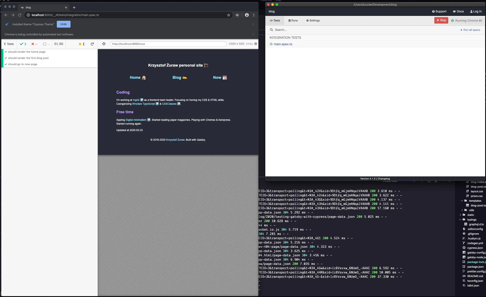
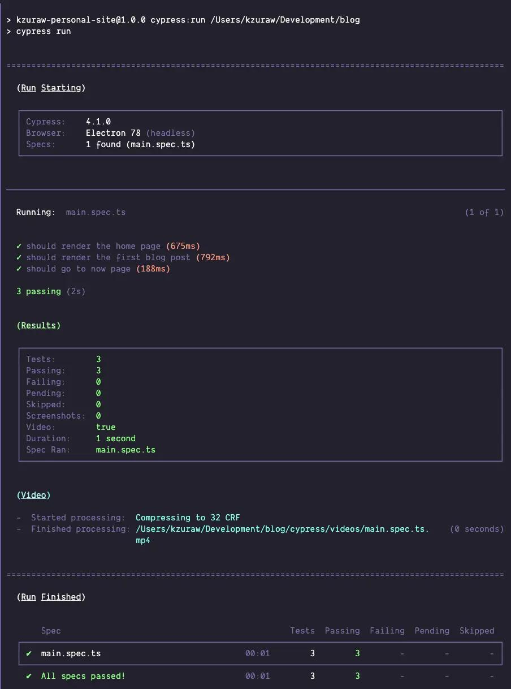

In this blog post, I will write about configuring [Cypress.io](https://www.cypress.io/) to work
with [Gatsby.js](https://github.com/gatsbyjs/gatsby) based blog.

Let's start by installing required packages from npm (I assume that you have already installed gatsby):

```shell
npm install --save-dev cypress start-server-and-test
```

also make sure to add the following `scripts` to `package.json`:

```json
{
  "scripts": {
    "dev": "gatsby develop", // or other script to run your development server
    "cypress:open": "cypress open",
    "cypress:run": "cypress run",
    "test:e2e:ci": "start-server-and-test dev http://localhost:8000 cypress:run"
  }
}
```

After that, you need to tell cypress your gatsby.js site `baseUrl` by specifying it inside `cypress.json` in
the root of your project:

```json
{
  "baseUrl": "http://localhost:8000"
}
```

If you then run `npm run cypress:open` and wait a little bit when cypress is verifying itself
(if you are on OSX) after a while, you should see a cypress dashboard with a welcoming message.
You can close it.



When you look into your files you may see that there is a new folder called `cypress` created. This
is the place where you gonna store your e2e tests.
For now, I recommend keeping `cypress/integration/main.spec.ts/js`.
Inside this file you can start writing your first test:

```ts
it("should render the home page", () => {
  cy.visit("/");
  cy.contains("YOUR PAGE CONTENT"); // change it to your content
});
```

If you want to add typescript support create `cypress/tsconfig.json`:

```json
{
  "compilerOptions": {
    "strict": true,
    "baseUrl": "../node_modules",
    "target": "es5",
    "lib": ["es5", "dom"],
    "types": ["cypress"]
  },
  "include": ["**/*.ts"]
}
```

You are now ready to run your first test 🎉. You can start by running `npm run dev` and when gatsby
development server is on, switch to the other terminal tab and execute `npm run cypress:run`.
Your tests should start - if they fail you can see screenshots & videos inside: `cypress/videos`
and `cypress/screenshots`. I recommend adding those paths to gitignore.



You may spot `test:e2e:ci` inside `package.json` scripts. It is used to run cypres on my PRs using
github actions:

```yaml
jobs:
  steps:
    - uses: actions/checkout@v1
    - name: Use Node.js ${{ matrix.node-version }}
      uses: actions/setup-node@v1
      with:
        node-version: ${{ matrix.node-version }}

    - run: npm ci
    - run: npm run lint
    - run: npm run tsc
    - run: npm run test:e2e:ci
      env:
        CI: true
```

There is also already made [github-action](https://github.com/cypress-io/github-action). To use it
you have to add following entry in your workflow file (under `jobs` section):

```yaml
cypress-run:
  runs-on: ubuntu-16.04
  steps:
    - uses: actions/checkout@v1
    - uses: cypress-io/github-action@v1
      with:
        start: npm run dev
        wait-on: "http://localhost:8000"
        browser: chrome
        headless: true
```

A full example of config is [here](https://github.com/krzysztofzuraw/blog/blob/master/.github/workflows/main.yml#L13-L26).

That's all. I don't have many e2e tests - I'm using them as a way to check if dependency updates made
by [Dependabot](https://dependabot.com/) not only pass TypeScript complicator but if they do not
break rendering of my blog.

## Summary

In this blog post, I presented a way to use [Cypress.io](https://www.cypress.io/) to test
[Gatsby.js](https://github.com/gatsbyjs/gatsby) blog. You can find how it works in action inside
my blog [repository](https://github.com/krzysztofzuraw/blog).
